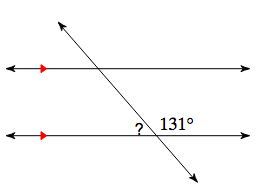

# Geometry "notes"?

## Definition of Linear Pair

| Term | Definition (or parts of it |
| ---- | ---- |
| Linear Pair | A pair of adjacent angles formed when two lines intersect. The non-common sides of the angles form a line. |
| Linear Pair | Is Supplementary|

## Problem:

 
Given \( \angle 1 = 131^\circ \), find the measure of \( x \) if it forms a linear pair with \( \angle 1\).

## Solution:

$ \angle 1 + x = 180^\circ $

$ 131^\circ + x = 180^\circ $

$ x = 180^\circ - 131^\circ $

$ x = 49^\circ $
\]

TLDR; linear pair = supplementary soo x = 180 - 131, which is 49
