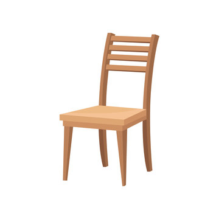

# Today we'll practice Markdown Tables, Link, Pictures

1. item 1
2. item 2
3. item 3

- item 1
- item 2
- item 3

* item 1
* item 2
* item 3
    * sub-item 1
    * sub-item 2

## Now let's work on links

[I like youtube](http://www.youtube.com)

## Now let's work on pictures

## Now let's do tables

These are my favorite cats

| Name | Facts             |
| ---  | ---               |
| Garfield | Likes Lasagna |
| Tom      | Chases Jerry  |
| Meowth   | Pokemon       |

##Now we'll do equations

$y = mx + b$

$f(x) = x^2$

$f(x) = \frac{3}{4}$
